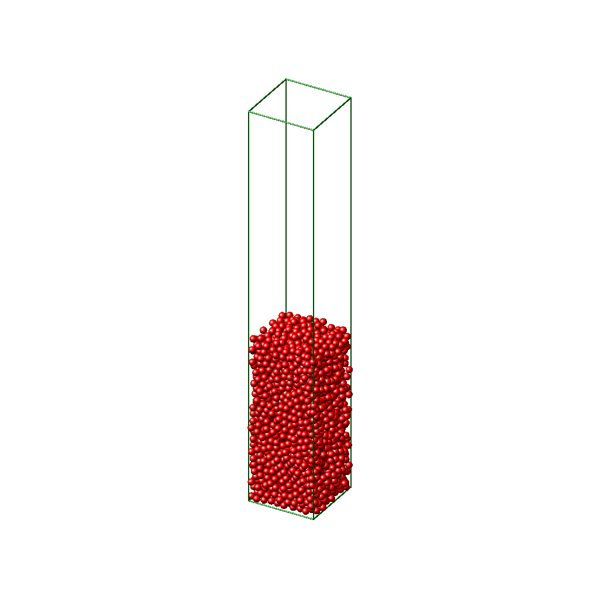

# packinganalysis
**Version**: `0.1.0-dev` (In Development)

A Python package for structural analysis of granular particle packings in 3D. It provides the following:

    - Packing density (with two methods: Voronoi and centroid methods),
    - Contact, coordination, and neighbor numbers,
    - Bond-orientational order parameters,
    - Radial distribution function.

## Installation
This package is in development and may not be stable.

```bash
pip install git+https://github.com/EsmaKurban/packinganalysis.git#egg=packinganalysis
```
Or if you have cloned the repository:

    pip install -e .

## Usage
This package analyses structures of packings of granular particles in 3D obtained from Molecular Dynamics (MD)/Discrete Element Method (DEM)
simulations. It provides particle properties e.g. volume, center of mass, moment of inertia from a given shape-file
.csv format. The particles are assumed to be composed of a number of spheres of varying radii. The shape-file
should include x, y, z coordinates, and radius of each constituent sphere. The particle shape and volume are
then passed to the class PackingAnalysis which accepts also simulation-file, simulation box dimensions.
The simulation-file should include id, x, y, z coordinates, radius, and Voronoi volume of constituent spheres.
The lateral (x-y plane) boundary conditions in the simulations are assumed to be periodic and the box is
bounded in the z-direction by a rough surface made of disordered particle packings at the bottom.

Here's a quick example of how to use the package for analysis of sphere packings:

```python
import matplotlib.pyplot as plt
import seaborn as sns

from packinganalysis import read_shape_data, particle_volume
from packinganalysis import PackingAnalysis

shape_filepath = "src/packinganalysis/data/sphere/shape.csv"
simulation_filepath = "src/packinganalysis/data/sphere/dump.csv"

width = 20
length = 20
spheres = read_shape_data(shape_filepath)
p_vol = particle_volume(spheres)
sphere = (PackingAnalysis(spheres, p_vol, simulation_filepath,
                           box_width=width,
                           box_length=length))


print(f"Packing density measured for sphere packing with Voronoi method is "
      f"{sphere.voronoi_density()} and with centroid method is "
      f"{sphere.centroid_density(box_height=5)}.")

print(f"Average contact and coordination number of sphere packing are "
      f"{sphere.contact_analysis()}.")

# Plot radial distribution function
rdf = sphere.radial_distribution_function(shell_width=0.025)
plt.figure(figsize=(7, 5))
plt.plot(rdf[:, 0], rdf[:, 1], color='red', linestyle='solid',
         linewidth=2, label='All pairs')
plt.ylabel(r'g(r)', size=14)
plt.xlabel(r'r/d', size=14)
plt.legend()
plt.tick_params(direction='in')
plt.show()

# Calculate order parameters for sphere packing
sphere.bond_orientational_order_parameters()

# Plot local order parameters q4 and q6 distribution of sphere packing
fig, ax = plt.subplots(1, 1, figsize=(5.6, 4.2))
sns.scatterplot(x='q4_tilda_bar', y='q6_tilda_bar', data=sphere.particle_data)
plt.xlabel(r'$\overline{\widetilde{q}}_{4}$', size=16, labelpad=5)
plt.ylabel(r'$\overline{\widetilde{q}}_{6}$', size=16, labelpad=5)
plt.xticks([0, 0.2, 0.4, 0.6, 0.8, 1])
plt.yticks([0, 0.25, 0.5, 0.75, 1])
plt.xlim(-0.1, 1)
plt.ylim(0, 1.025)
plt.tight_layout()
plt.show()
```


More details regarding the metrics and methods used for the analysis can be found in the article
[Structural analysis of disordered dimer packings](https://doi.org/10.1039/D1SM00960E) and in the article
[Machine learning approaches for the optimization of packing densities in granular matter](https://doi.org/10.1039/D2SM01430K).

## Contributing

We welcome contributions! Since the package is still in the `0.1.0-dev` stage, please be aware that there may be frequent changes to the API.

Feel free to fork the repo and submit pull requests. Ensure your changes are compatible with the current state of the development branch.

> **Note**: This version is not stable yet and may change significantly.

## Licence
This project is licensed under the MIT License - see the LICENSE file for details.

## Contact
For any questions or feedback, feel free to open an issue on GitHub or
contact me at [esma.kurban92@gmail.com].
